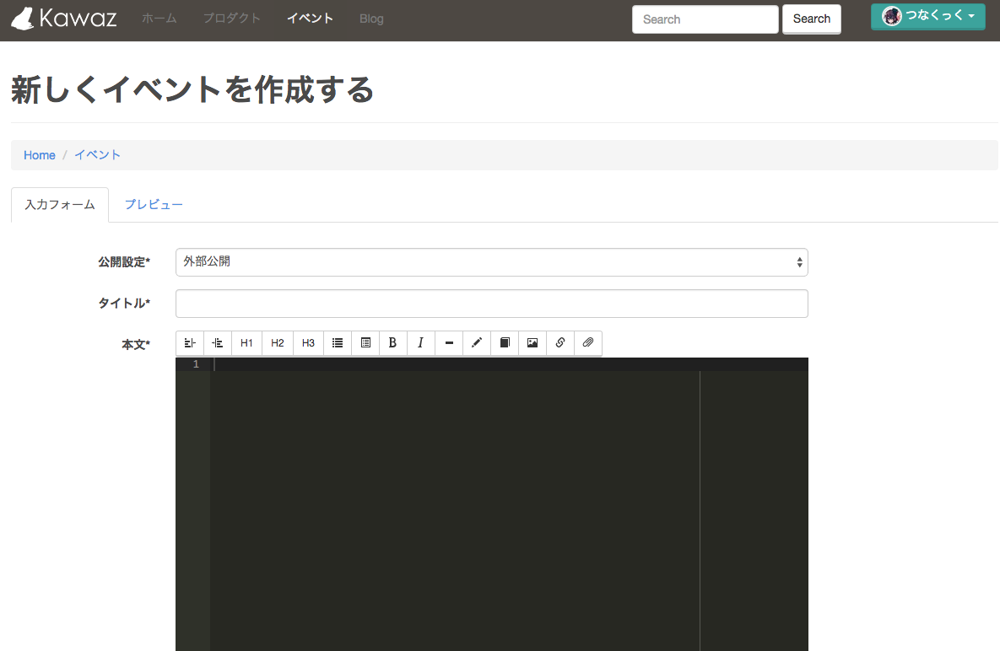

# イベントページの使い方

Kawazでは大小さまざまなイベントが開催されています。
グローバルゲームジャムのような大規模のものから、全体ミーティング、勉強会、作業会や動物園に行く会、珍しいモノを食べに行く会……

意識の高い（？）ものからくだらないものまで、興味のあるイベントには積極的に参加しましょう！

勉強になることはもちろんのこと、Kawazメンバーと親睦を深めればゲーム制作もずっとしやすくなるはずです。

## イベントに参加しよう

各イベントページの右上にある、緑色の「イベントに参加する」ボタンをクリックするだけで参加完了です！

イベントによっては参加締め切り日や人数上限が設定されているものもありますから、自分のスケジュールを調整しておきましょう。
参加締め切り日がすぎてしまうと、主催者が変更しない限りそのイベントには参加できなくなってしまうので注意が必要です。

Kawazのイベントは基本的に無料で参加できますが、飲み会や動物園など、一部参加費が必要な場合もあります。
概要をよく確認しましょう。

## イベントを企画しよう

もちろん、あなたがイベントを企画することだって自由です！

イベントの概要をmarkdownという記法で記述できます。
markdownの書き方はこちらを参照してください。

概要文の他には、
- 開始日時・終了日時
- 場所
- 参加可能人数
- 参加締切日
- カテゴリ
これらを設定することができます。
それぞれまだ決まっていない、もしくは参加可能人数や参加締切日が特にない場合は空欄のままで大丈夫です。

カテゴリの中にふさわしい項目が見当たらない場合は、ポータル開発者にリクエストしてください。

プレビューしながら概要を作成し、「保存」を押して設定完了です！
イベントの概要や開催日などは後から変更できます。
