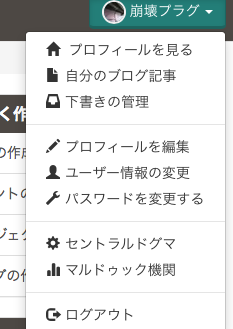
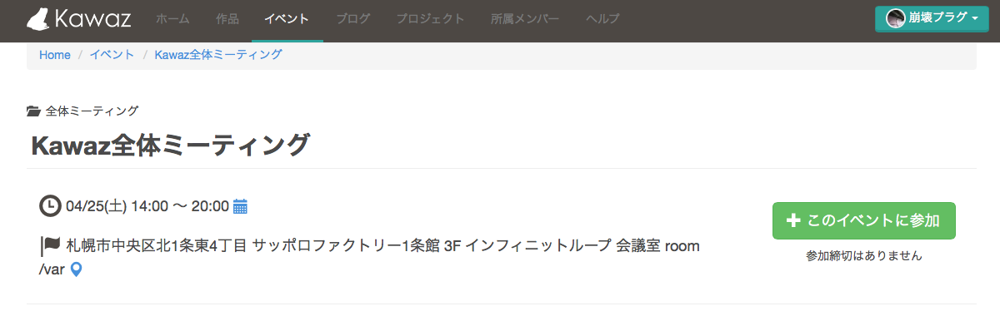
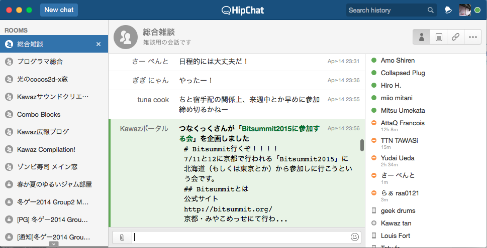
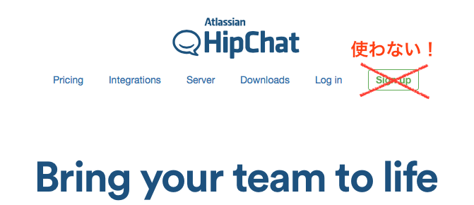
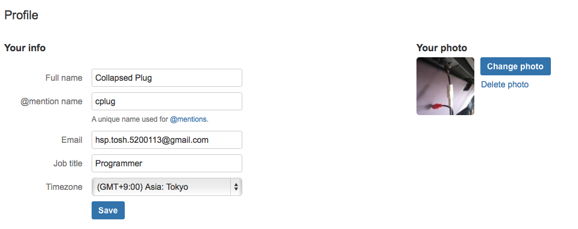
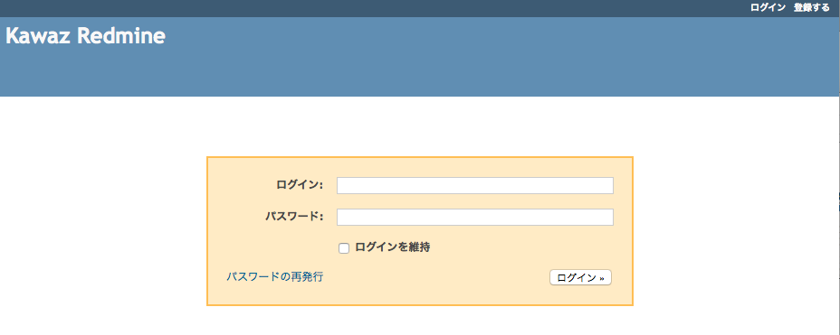

# Kawaz入会者の手引き

このページには、Kawazに入会してまずやるべきことが書いてあります。入会した方は必ずよく読んでください。

## プロフィールの設定

Kawazのメンバーは全員、自分の**「プロフィールページ」**を持っています。  

ここで、自分のハンドルネームやスキル、今まで作った作品、自分の好きな作品、SNSアカウントなどの情報を登録できます。**自分をアピールできる場の１つ**ですし、何らかの理由で後述のHipChatによる連絡が出来ない時でも、SNSアカウント経由で連絡ができるので、忘れずに設定してください。  
プロフィールページの変更画面は、ポータル右上のユーザーメニューの上から４番目「プロフィールを編集(言語設定によってはChange Profile)」にあります。  
また、その下の「ユーザー情報の変更(Change user information)」では、アバターやムードメッセージ[^1]、ハンドルネームを登録できます。プロフィールの詳しい編集方法は、[こちら](https://www.kawaz.org/helps/profiles/)を参照してください。  

[^1]: ムードメッセージはユーザーページなどで名前の下に出てきます。

---

## 全体ミーティングへの参加登録

Kawazでは毎月１回全体ミーティングを開いています。顔合わせや、Kawazについての説明をするほか、すでに動いているゲーム開発プロジェクトへの参加などができますので、なるべく参加をお願いします。

また、参加する際は必ず、[イベントページ](https://www.kawaz.org/events/)にて「**Kawaz全体ミーティング**」というイベントを見つけて、**「＋ このイベントに参加」ボタンを押して参加登録をしてください。**  
  
もしイベントが見つからない場合は、今月のミーティングがすでに終了しているか、まだイベントページが作成されていないので、定期的にチェックしてみてください。  

---

## HipChatへの登録

Kawazでは、プロジェクト内での情報交換を始めとした主な通信手段として**HipChat**と呼ばれるチャットを使用しています。これに登録しましょう。  

**注意**: HipChatのホームページを見ると、このように個人でアカウントが取れるように見えますが、 **絶対にこの方法でアカウントを取得してはいけません！** 　　

HipChatはグループ招待制をとっているのですが、個人でアカウントを取得してしまうと「*新しいグループを作成した*」という扱いを受けてしまい、そのアカウントではKawaz内のチャットを見ることが一切できなくなります。従って、以下の手順でアカウントを取得してください。同じ理由で、すでにHipChatを利用されている方も、この手順で新しく取得してください。  
　

### 登録しよう

1. HipChatで利用したいメールアドレスを連絡(下記参照)
2. 指定したメールアドレスに、招待メールが届く
3. メールのURLより、HipChatでの**表示名(Name)**・**スキル(Job title)** [^2]・**@発言名(@mention name)** [^3] を設定してください。Timezoneは(GMT+9:00) Asia: Tokyoを設定します。

使用したいメールアドレスの連絡方法は２つあります。

* [webmaster@kawaz.org](mailto:webmaster@kawaz.org) に、ユーザー名(orハンドル名)とHipChatで使用したいメールアドレスを送信する。
* 運営メンバーのTwitterアカウントに対して、DMなどで使用したいアドレスを連絡する

運営メンバーのTwitterアカウントは以下の通りです。  
@ayako119 (みぃお(miio mitani))  
@lyrica09 (白黒りりー)  
@CollapsedPlug (崩壊プラグ)  

[^2]: 自分の一番得意なスキルに設定しているメンバーが多いです
[^3]: HipChatでは、Twitterのように、@発言名を使用して特定のユーザーに対するメッセージを書くことができます。例: (「@abc 発言名ABC宛のメッセージ」) メンバーの大半はKawazポータルで使用したユーザー名にしています。

### 登録できたら

HipChatはWeb上でも利用できますが、PC版HipChat(Mac, Win, Linuxに対応しています)がありますのでそちらを使いましょう。また、スマホをお持ちの方は、App Store, Google Play Storeからスマホ版HipChatがダウンロードできますのでそちらもダウンロードしておきましょう。  

そのほか、HipChatの詳しい使い方は[こちら](HipChatの使い方ページをRedmineから移設する)のページから確認してください。

---

## Kawaz Redmine、Kawaz GitLabへの登録

**Kawaz Redmine**, **Kawaz GitLab**は、Kawazでの活動にあたって使用することの多いツールです。このツールは、必要になった時に登録していただければ結構です。

### Kawaz Redmine

プロジェクトの進捗管理・割り当て管理などを行うことのできるトラッカーツールです。
	
#### 登録の仕方
  
[こちら](http://redmine.kawaz.org/)からKawaz Redmineにアクセスし、右上の"登録する(Register)"から、必要な情報を送信してください。

運営側で登録が承認されるとメールが届きます。そのメール内のURLをクリックしていただくと、Kawaz Redmineが使えるようになります。

### Kawaz GitLab

Kawazで使われているクローズド環境のGitリポジトリ管理ツールです。  

#### 登録の仕方

Kawaz GitLabへの登録は個人ではできません。運営メンバーに、GitLabを利用したいメールアドレスを連絡してください。メールアドレスの連絡方法は、HipChatで利用するメールアドレスの連絡方法に準じます。  

---

## 登録を推奨するサービス

### Skype

[Skype](http://www.skype.com/ja/)  
すでに利用されている方も多いと思われますが、KawazではHipChatでの連絡ができない際などにSkypeが使われることがあります。もしアカウントをお持ちの場合は、**ユーザー名をポータルのプロフィールページに掲載してください**。

### DropBox

[DropBox](https://www.dropbox.com)アカウントの取得  
すでに利用されている方も多いと思われますが、Kawazでは素材(キャラクター画像や音声など)のやりとりにDropBoxがつかわれているケースが多いです。登録しておくと、プロジェクトに参加した時に作業がしやすくなります。また、こちらについても、アカウントをお持ちの場合は**ポータルのプロフィールページにアカウントを掲載してください。** 作業フォルダの共有がスムーズになります。

### Gyazo

[Gyazoのダウンロード](https://gyazo.com/downloading?lang=ja)  
スクリーンショットを撮影し、それをURLを知る人のみが見ることのできる状態にしてアップロードできるサービスです。HipChatでは、よく「Gyazoでスクリーンショット撮影→URL共有」という形でスクリーンショットが貼られています。短めの動画(GIF形式)も撮影できます。

### Google Account

[Google Account](https://accounts.google.com/SignUp)の取得  
Kawazではいろんな場面でGoogle Docsが使われることが多いので(例: ミーティングのスケジュール表)、Googleのアカウントを持っていると便利です。