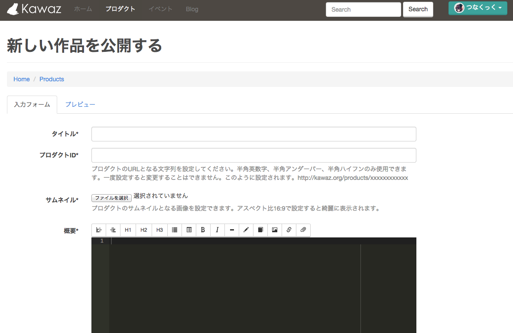
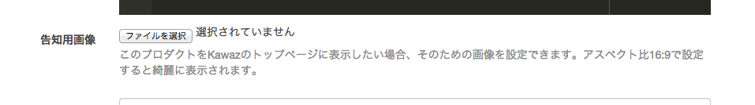

# プロダクトページの使い方

プロジェクトの完成おめでとうございます！

せっかく作ったゲームをちゃんと紹介するページを作りたいけど、作る方法がわからなかったり、技術が無かったり、そもそも面倒だったりしていませんか？

そんなときはKawazのプロダクトページに登録しましょう。

せっかく作ったゲームが認知されないのはもったいないですからね！

## 作品が完成したらプロダクトに追加しよう

[プロダクト作成画面へ](http://kawaz.org/products/create)

基本的にはイベントやプロジェクトの作成方法と同じように、フォームに必要な項目を設定して保存すれば公開されます。

## Kawazトップページへの掲載について

プロダクト作成時に告知用画像を設定しますが、これはKawazのトップページある「最近のゲーム」に自動的に追加されます。

Kawazトップページ（非ログイン時）では「最近のゲーム」以外にも、

- Kawazの代表作
- タイル表示
- スライド表示

の3カ所に告知用画像を表示する領域が用意されています。

Kawazメンバーでない外部の人がトップページを見たときに、制作されたゲームにはどのようなものがあるかをアピールしやすくするためです。

「最近のゲーム」は掲載順のため、古いモノは表示されませんが、この3カ所の表示はKawazトップページ上で固定され、表示され続けます。

「このゲームは絶対に神ゲーだから絶対アピールしたい！」「埋もれさせたくないので表示させてほしい」という場合は、管理者にその旨を伝えてください。
