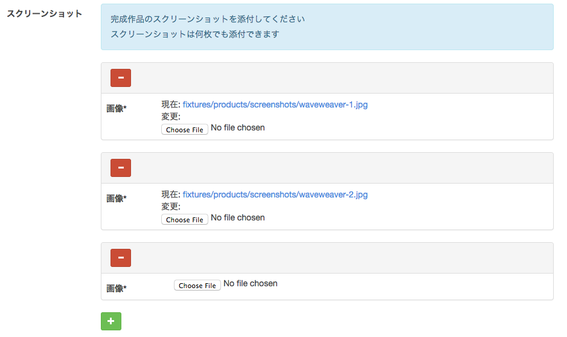
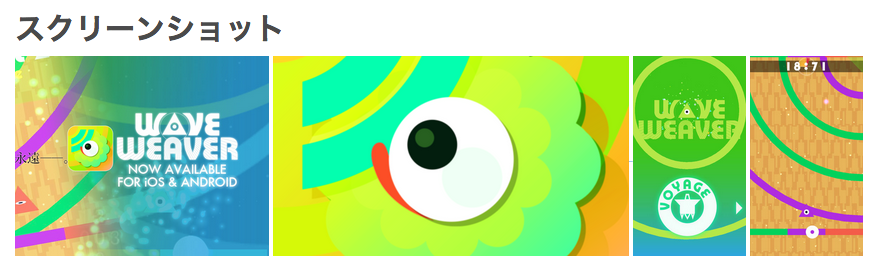
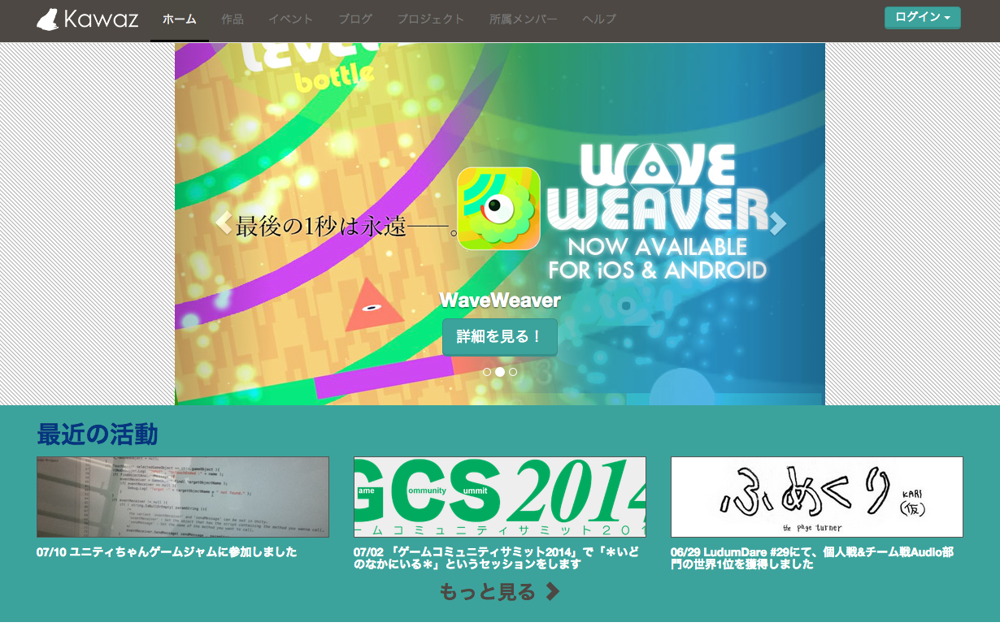
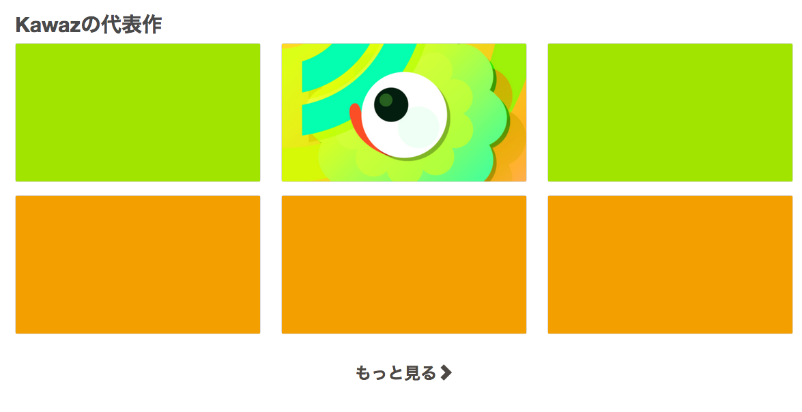
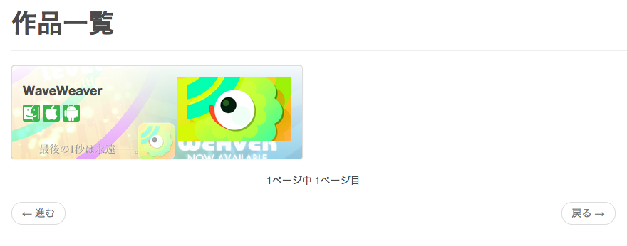

# 作品を作成しよう

プロジェクトの完成おめでとうございます！

せっかく作ったゲームをちゃんと紹介するページを作りたいけど、作る方法がわからなかったり、技術が無かったり、そもそも面倒だったりしていませんか？

そんなときはKawazの作品ページに登録しましょう。

せっかく作ったゲームが認知されないのはもったいないですからね！

## 作品が完成したら作品として公開しよう

プロジェクトの状態を「完成」にして、プロジェクトページにアクセスすると、まだ作品として公開されていない場合、以下のようなボタンが表示されます。

こちらから作品を公開しましょう。

また、トップページの「[作品を公開する](/products/create/)」からでも作品を作成することができます。

[作品公開画面へ](http://kawaz.org/products/create)

## 作品の登録方法

### 作品登録に必要なもの

作品登録を始める前に、以下の素材を用意してください。

これまで、プロジェクトのサムネイル画像は形式に制限がありませんでした。

「作品」は外部に公開する物であるため、見栄えを統一するために画像サイズなどに制限があります。
用意するのは多少手間となりますが、ご協力よろしくお願いします。

**最低限必要なものはサムネイルだけです**。

|名前|形式|備考|
|-----|--------|---------|
|**サムネイル（必須）** | 必須。800 * 450推奨（または16:9の画像） | 作品用サムネイルです。必ず1枚は用意してください。推奨サイズが用意できない場合は、16:9のアスペクト比で用意してください |
|告知用画像 | 任意。800 * 450（または16:9の画像） | 作品をトップでさらに目立たせるための画像です。トップページに大きく表示したい場合は用意してください |
|トレーラー | 任意。YouTubeに動画をアップロードする | ゲームのトレイラーです。設定すると、詳細ページで動画を見やすく表示することができます |
|スクリーンショット | 大きさ、アスペクト比、枚数自由 | ゲームのスクリーンショットです。ゲーム中の見せたい画像を何枚でも掲載することができます |
|配付用ファイル | 任意。ZIP/exeなど | ゲームをダウンロードして遊ぶ形式の場合、実行ファイルなどを配付形式で用意してください |
|配付用URL | 任意 | App Store, Google PlayやPS Mobileなど、外部サイトでしかダウンロードできない場合、登録作業を済ませてURLを用意してください |

サムネイルと告知用画像を正しく設定すると、以下のように表示されます。

### 「リリース」の種類と登録

一つの作品に複数の「**リリース**」を設定することができます。

例えば、あなたのゲームが複数のプラットフォームに対応していた場合、それぞれのバージョンが一つずつのリリースに当たります。

リリースは以下の2つの種類があり、それぞれ何個でも付け加えることができます。

|リリースの種類|概要|
|------------|----|
|URLリリース | App StoreやGoogle Playなど、外部にダウンロードサイトにリンクしている場合 |
|パッケージリリース | ダウンロードして遊ぶゲームなど、ファイルをKawazポータルに持つ場合 |

リリースを追加するには、「作品の作成」フォーム内にある「URL」、「パッケージ」のフォームから追加することができます。

各リリースには、名前、バージョン名、プラットフォームを設定できます。例えば以下のように設定することで、様々な形式でゲームなどを配布することができます。

もちろん、完成作品以外に資料集、追加コンテンツを配布したり、サントラの配付なども簡単に行えます。

|リリースの種類|ラベル|プラットフォーム|バージョン|概要|
|-----------|----|---------|--------------|-----|
|URL | iOS版 | iOS | 1.0 | iPhoneで遊べるバージョン1.0 |
|パッケージ | Windows版 | Windows | 1.0 | Windowsで遊べるバージョン1.0 |
|パッケージ | ステージエディタ | Windows | 2.0 | Windowsで動くステージエディタ |
|パッケージ | サウンドトラック | その他 | 1.0 | オリジナルサウンドトラック |

### スクリーンショットの登録

ゲーム内の画像は別途スクリーンショットとして何枚でも登録することができます。

枚数、形式、大きさは自由です。

## 「表示モード」について

「作品」には3つの表示モードがあります。

|名称|概要|
|-------|-----------|
| カルーセル + トップにタイル表示 | Kawazトップページのカルーセルに大きく表示された上、トップページに常時表示されます。この表示にするためには**告知用画像の設定**が必要です |
| トップにタイル表示 | Kawazトップページに常時表示されます |
| 通常表示 | 新しく作成された物だけトップページに常時表示されます。古い物はKawazトップページには表示されません |

### カルーセル表示

### トップにタイル表示

### 通常表示

表示モードは、**一般メンバーが変更することはできません**。運営メンバーのみが変更することができます。
これは、Kawazメンバーでない外部の人がトップページを見たときに、多くのゲームが並んでしまい、混乱を招くのを避けるためです。

通常、どのゲームを目立たせて表示させるかは、製作期間や、参加人数、ゲームの完成度などを加味して運営メンバーが決定します。
もし、自分の作品の表示モードを切り替えたい場合は、運営メンバーまでご連絡ください。

## Unityのゲームなどを作品ページに組み込む

作品の概要にはHTMLを使うこともできるため、Flashゲームや、Unity Web Playerのゲームを直接組み込むことも可能です。

その場合、パッケージリリースとして、`.unity3d`ファイルを直にアップロードし、概要ページにプレイヤーのタグを埋め込んで直リンクしてください。

Unityのゲーム公開については将来的に対応できるようにしたいです。
