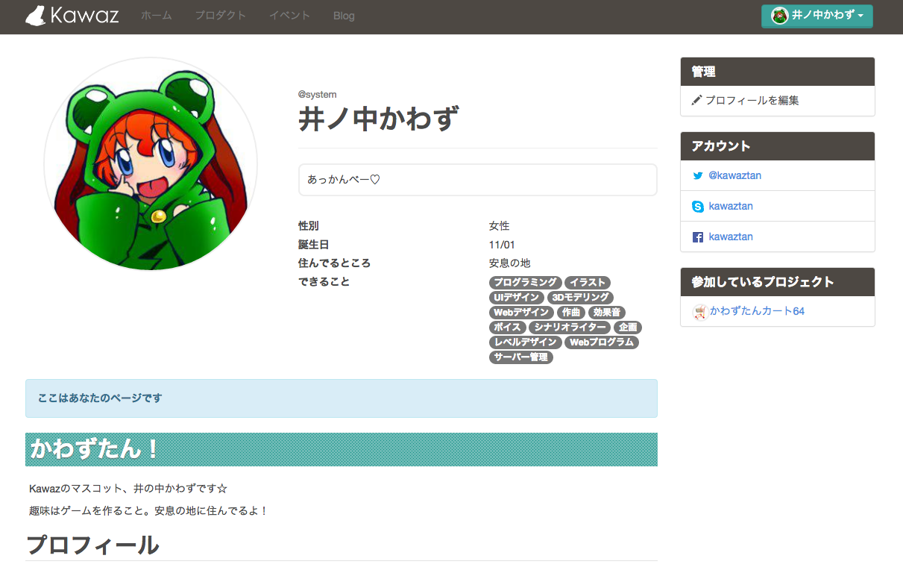
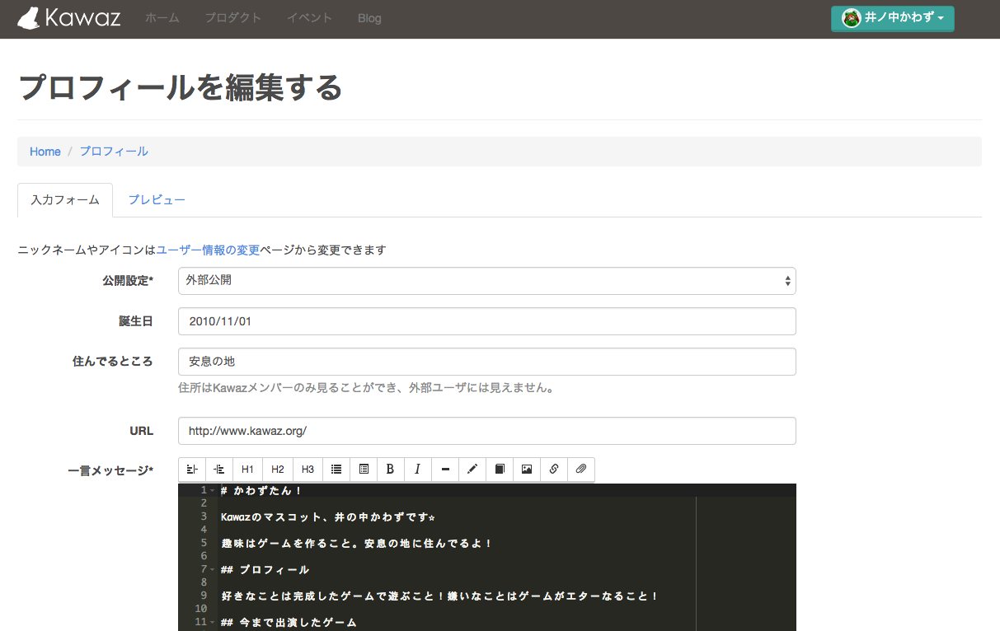
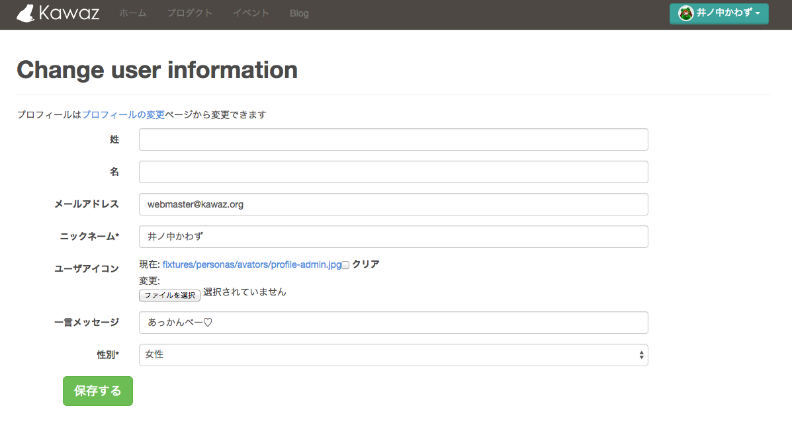

# プロフィールを編集・設定しよう

プロフィールページでは、すでにいるKawazメンバーが見れるよう、あなたのプロフィールを設定してみましょう。

プロフィールの設定・変更には「ユーザー情報の変更ページ」「プロフィールを編集ページ」という二つのページで行います。

## プロフィールを編集ページ

文字通り、プロフィールの編集をします。

特に、やりたいことやできること、好きなゲーム、作ってみたいものを明記しておけば、プロジェクトを運営しているメンバーがプロジェクトに誘いやすいです。

また、DropboxやSkypeなどプロジェクトに必要なものや、PlayStationNetworkやXboxLiveなど、使っているWebサービスのアカウントも登録しておくことができます。

特に、

- Dropbox
- Skype
- Twitter

についてはゲーム作成で必要になることが多いため、もし持っている場合は必ず登録しましょう！

[プロフィール変更ページへ](http://kawaz.org/members/my/update/)

## ユーザー情報の変更ページ

登録メールアドレスやニックネーム、使用アイコンなどはここで変更します。

[プロフィール変更ページへ](http://kawaz.org/registration/update/)

