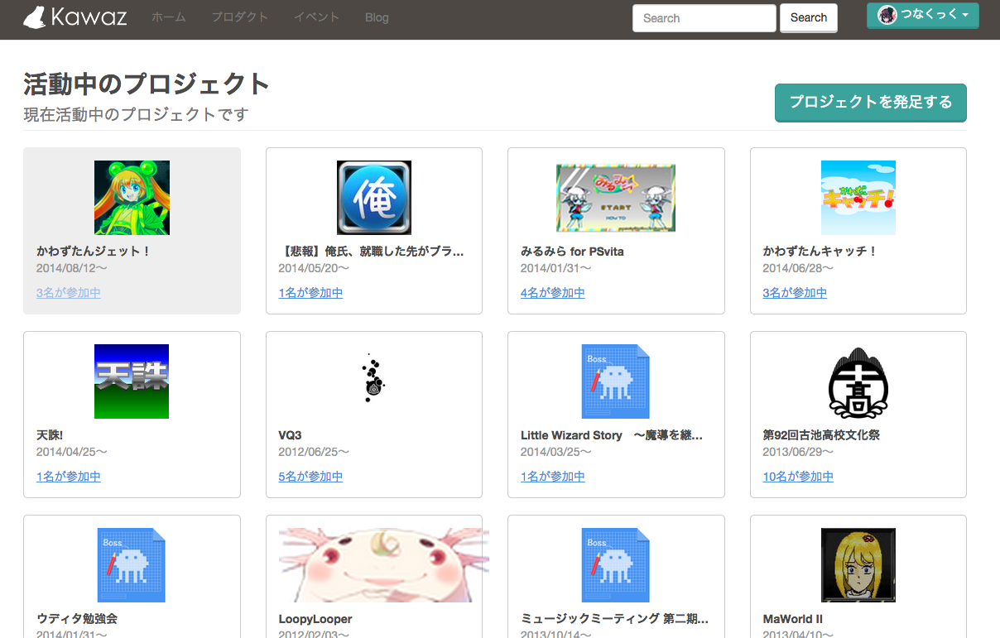
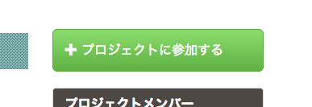
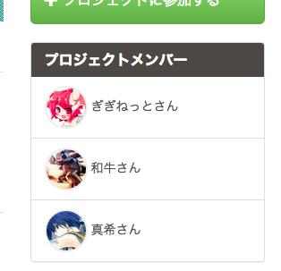
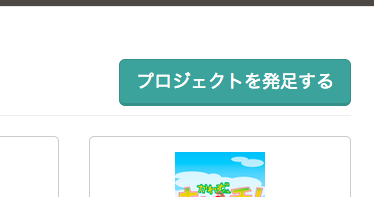
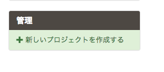
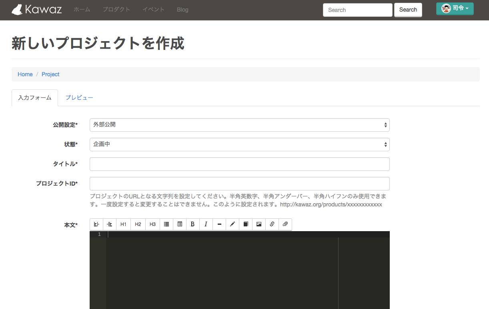

# プロジェクトページの使い方

「ゲーム制作者コミュニティ Kawaz」はその名の通りゲーム制作者が集まるコミュニティなので、数々のプロジェクトが生まれています。

ゲーム制作はもちろん、音楽のコンピレーションアルバムや小説同人誌のようにゲーム以外の企画まで、どんどん面白いことに巻き込んで＆巻き込まれていきましょう！

## プロジェクトに参加しよう
面白そうなプロジェクトがあったら積極的に参加してみましょう。

少しでも興味がある、できることがあれば手を挙げてみてください。

「自分は何もできないから……」「足を引っ張るんじゃないだろうか……」と不安に思うかもしれませんが、とりあえず思い切って飛び込んでみるのがいいでしょう。

### プロジェクトへの参加方法

参加を締め切っているプロジェクトもありますが、参加できるプロジェクトにはこのような緑色のボタンが表示されています。

これを押すだけで参加が完了するので、プロジェクトの管理者に連絡を取りましょう。

自動的に下にあるメンバー一覧に追加されます。

Productを作成するために、

- サムネイル(必ずアスペクト比16:9で)
- 告知用画像（アスペクト比は16:9が推奨。あるとKawazポータルのトップに掲載するときに便利）
- スクリーンショット（サイズ自由、枚数自由、何枚でも添付できる）

の画像を用意する必要があります。

## プロジェクトを企画しよう

なにか面白い企画を思いついた、「これは神ゲーだ！！！」というゲーム企画を持っている、その他やってみたいことがある……

そういった場合は自分でプロジェクトを作成してみましょう。

「プログラミングはできるけど絵と音楽ができないからできる人を募集したい」というのもいいですし、「気楽にやりたいから一人プロジェクトを立てる」というのでもいいです。

とにかく面白いことを始める一歩を踏み出してみましょう。

## プロジェクトリストの見方

Kawazのプロジェクトは、作成時に設定したステータスによって大別されています。

[http://stg.kawaz.org/projects/](http://stg.kawaz.org/projects/)

- 活動中のプロジェクト
- 企画中かつ3ヶ月以内に作成されたプロジェクト
- 3ヶ月以上前に作成され、活動中でなかったり企画中でないプロジェクト
　（活動を停止したプロジェクトなども含む）

あまり放置しているとどんどん目立たない表示になってしまうので、なるべく活発に活動するようにするのがいいかも？

### プロジェクトを作成

活動中プロジェクト一覧ページの右上か、

プロジェクト詳細ページの右側にあるリンクをクリックしてください。

この画面でプロジェクトを作成します。

[プロジェクト作成画面へ](http://kawaz.org/projects/create)

