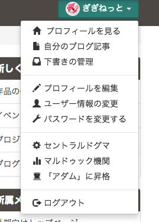
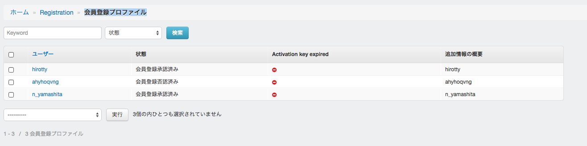
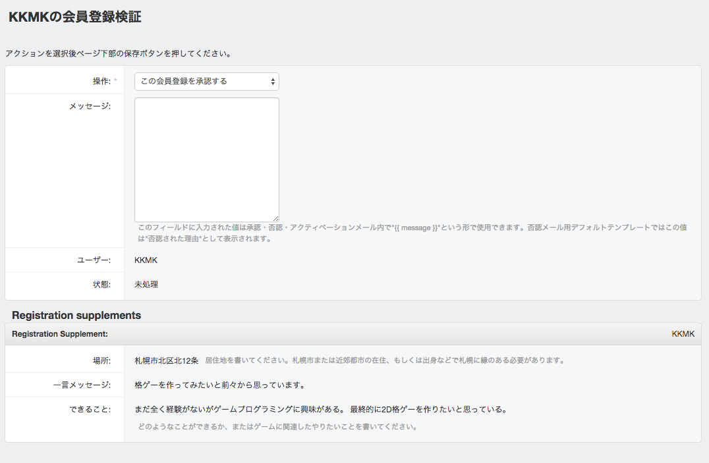
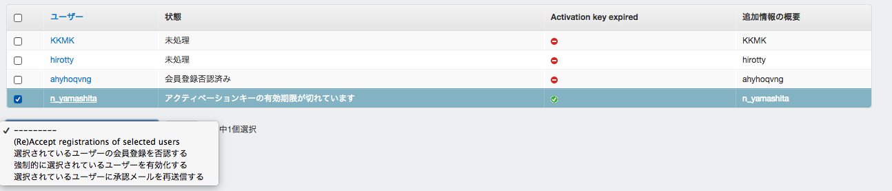

# 新規会員登録申請の承認方法

## 新規会員登録を受け取る

新規会員登録に

## セントラルドグマに行く

右上のメニューから「セントラルドグマ」を選択して管理者ページへ行きましょう



## 会員登録プロファイル

新規仮会員登録 > 会員登録プロファイルを選択すると、現在の会員登録申請の一覧が表示される。



## 会員登録を承認、拒否する

それぞれの会員登録プロファイルページに行く。



まず、画面下部の「Registration Supplements」の情報を見て、申請内容が[規約](/rules)と合致しているかをチェックする

- 札幌の近く住んでいるか、または住んでいないがミーティングに参加可能ということが示されているか
- できることが示されているか

その後、「操作」から、承認、拒否を選ぶ。

「メッセージ」欄には申請者に対してメッセージを送ることができる。以下に例文を示すので、SPAMなどの場合を除き、必ずメッセージを記入すること

### 承認の例

```
○○○さん

会員登録申請ありがとうございます、札幌ゲーム製作者コミュニティKawazのXXXです。

申請を承認致しましたので、このメールにしたがって、本登録をお願いいたします。

今月△日に全体ミーティングを開く予定です。

https://www.kawaz.org/events/000/

顔合わせや、Kawazについての説明、すでに動いているゲーム開発プロジェクトへの参加などのために、なるべくご参加ください。
もし、ご都合が付かない場合は毎月ミーティングを開催しておりますので、定期的にイベントページをチェックしてみてください。

https://www.kawaz.org/events/


また、ログイン後は他のメンバーと交流するために、必ずプロフィール設定を行ってください。
特にTwitterやSkypeのアカウントをお持ちの方は、必ず登録してください。

今後ともよろしくお願いします！
```

### 非承認の例

```
○○○さん

会員登録申請ありがとうございます、札幌ゲーム製作者コミュニティKawazのXXXです。

せっかく登録申請を頂いたのですが、申請内容に不備がありました。

Kawazに入会してやりたいことが示されていません。Kawazでは、実際にゲーム作りに携わる仲間を募集しているため、
参加登録前に自分の得意なことややってみたいことを伺っています。
もし、未経験の場合でも構いません。

もう一度規約をご確認の上、再送お願いします。

https://www.kawaz.org/rules/

何かございましたら、webmaster@kawaz.orgまでお問い合わせください。

```

## 承認メールを送ったのに放置されてる例

状態に「アクティベーションキーの有効期限が切れています」と表示されている場合、以下の操作を行ってください。

これは、会員登録が承認されたにもかかわらず、1週間以上相手が放置してる状態です。

その場合は、再度承認して、メールを送り直さなくてはいけません。

1. そのユーザーをチェック
2. Accept registrations of selected usersを選択して実行
3. 選択されているユーザーに承認メールを再送信する

これを数回やって、スルーされたら放置


